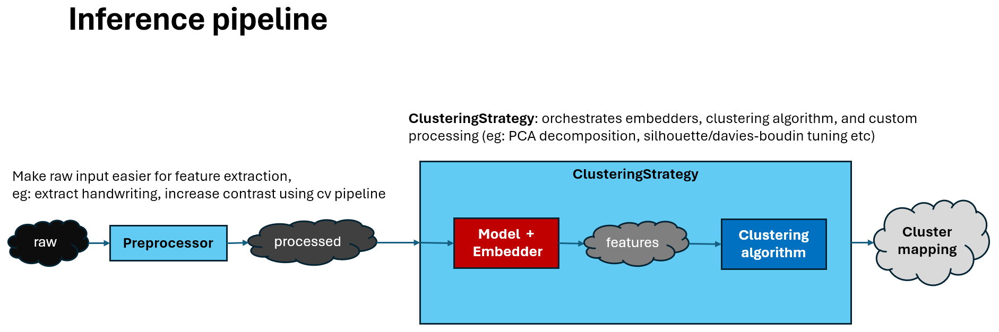

# plom\_ml\_clustering  

Machine Learning clustering model architectures and training for the [Plom](https://github.com/plomgrading/plom) grading system. This repo **only** covers how to generate the models that generate embeddings, i.e the **red component (Model + Embedder)** in the following diagram:
<p align="center">
  
</p>


As of Aug 2025 supports:

* **HME Clustering** — clusters handwritten mathematical expressions.
* **MCQ Clustering** — groups scanned handwritten multiple-choice answers (A–F / a–f, with 'C' and 'c' merged) into semantic clusters.

These systems are designed for integration with Plom's grading workflow, enabling fast, semi-automated grouping of student responses to reduce marking time and provide insights on students' performance.

---

# 👁️ Preview of Integration with Plom
<p align="center">
  
</p>

A longer version: [extended demo]()

---

# 🧠 Systems Overview

## **1️⃣ Handwritten Math Expression (HME) Clustering**

| Aspect                     | Details |
|----------------------------|---------|
| **Goal**                   | Cluster handwritten math expressions by **structural and semantic content** |
| **Model Architecture**     | ResNet-34 feature extractor (HMESymbolicNet) + TrOCR encoder for symbolic representation (Public model) |
| **Training**               | Supervised training on Multi-hot symbol labels with BCELogitLoss and weight shifted to rarer symbols for better long-tailed dataset |
| **Representation**         | Pooled encoder embeddings, L2-normalized |
| **Clustering Method**      | Agglomerative on  embeddings produced by both models |
| **Datasets**               | **Train/Val:** [Mathwriting-2024](https://arxiv.org/abs/2404.10690) <br> **Test:** [CROHME 2019](https://tc11.cvc.uab.es/datasets/ICDAR2019-CROHME-TDF_1%7D), custom dataset |

---

## **2️⃣ Multiple-Choice Question (MCQ) Clustering**

### MCQ v1 — *AttentionPooling + Classification Pretrain*

| Aspect                     | Details |
|----------------------------|---------|
| **Goal**                   | Cluster handwritten MCQ answers by letter choice (A–F / a–f, with C/c merged) |
| **Model Architecture**     | ResNet-18 backbone (ImageNet-pretrained, grayscale) + AttentionPooling + 11-class head |
| **Training**               | Supervised classification; Loss: cross-entropy |
| **Representation**         | Softmax probability vectors + optional temperature scaling + Hellinger transform |
| **Clustering Method**      |  Agglomerative on probability vectors |
| **Datasets**               | **Train/Val:** [EMNIST ByClass](https://www.nist.gov/itl/products-and-services/emnist-dataset) filtered + augmentation <br> **Test:** Custom handwritten MCQ dataset |

### MCQ v2 — *Projection Head + Center Loss*

| Aspect                     | Details |
|----------------------------|---------|
| **Goal**                   | Improve cluster purity via compact embedding space |
| **Model Architecture**     | ResNet-18 backbone (no AttentionPooling) + projection head (low-dim embeddings) |
| **Training**               | Cross-entropy + Center Loss |
| **Representation**         | L2-normalized projection head embeddings |
| **Clustering Method**      | KMeans (k=11), Agglomerative on embeddings |
| **Datasets**               | **Train/Val:** same as v1 <br> **Test:** same as v1 |

---
# 📊 Evaluation (Purity)

## **1️⃣ Handwritten Math Expression (HME) Clustering**


| Backbone         | Representation         |Mathwriting-2024 | CROHME 2019 | Custom dataset |
| ---------------- | ---------------------- | ------ | ----- | ------ |
| ResNet34 + TrOCR | PCA-reduced embeddings | TBD | TBD   | TBD |

Note: evaluation on CROHME 2019 is done only to top 50 most common equations. This is to avoid potential blow up purity due to small member cluster (especially single member cluster).

## **2️⃣ Multiple-Choice Question (MCQ) Clustering**

| Variant   | Backbone                               | Representation            | EMNIST | Custom dataset |
| --------- | -------------------------------------- | ------------------------- | ------------- | --------------------- |
| Version 1 | ResNet18 + AttentionPooling            | Probabilities (Hellinger) | 0.9652           | 0.9751                   |
| Version 2 | ResNet18 + ProjectionHead + CenterLoss | Embeddings (cosine similarity space)                | 0.9641           | 0.9751                   |

---
# 🚀 Getting Started

### Prerequisites

Install dependencies:

```bash
pip install -r requirements.txt
```

### Prepare training data
```bash
python3 -m scripts.data_prep.hme #HME
python3 -m scripts.data_prep.hme #MCQ
```


### Training (HME)
```bash
python3 -m training.HME_training 
```

### Training (MCQ)
```bash
python3 -m training.MCQ1_training.py # Trained purely for classification.
python3 -m training.MCQ1_training.py # Trained with clustering in mind (CenterLoss).
```


---
# 📥 Getting pretrained weights

### MCQ (V1)
```bash
python3 -m scripts.get_pretrained_weights.mcq
```

### HMESymbolic
```bash
python3 -m scripts.get_pretrained_weights.hme
```


---
# 📥 Getting public model (and strip + quantize)
### TrOCR 
reference: [arXiv:2109.10282](arXiv:2109.10282)
```bash
python3 -m scripts.get_public_model.trocr
```